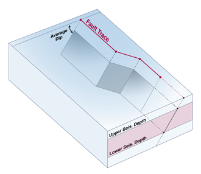

OpenSHA stores geospatial data in [GeoJSON](https://geojson.org/), which is specified in [RFC 7946](https://datatracker.ietf.org/doc/html/rfc7946). OpenSHA code for (de)serializing GeoJSON can be found in the _[org.opensha.commons.geo.json](https://github.com/opensha/opensha/tree/master/src/main/java/org/opensha/commons/geo/json)_ package.

_Note on depths/elevations: OpenSHA stores depth data in km, positive down. For example, a value of `3.0` in the third column of a coordinate array indicates that the given point is 3 km below the surface. This differs from the [GeoJSON specification](https://datatracker.ietf.org/doc/html/rfc7946), but is in-line with the [USGS Event Web Service](https://earthquake.usgs.gov/earthquakes/feed/v1.0/geojson_detail.php) and general treatment of 3D location data in OpenSHA and other PSHA codes._

## Table of Contents

* [Fault Data](#fault-data)
  * [Requirements](#fault-data-requirements)
  * [Optional](#fault-data-optional-extensions)
  * [Note on fault traces for buried, dipping faults](#note-on-fault-traces-for-buried-dipping-faults)
  * [Example](#example-fault-data-geojson)
* [Regions](#regions)
  * [Example](#region-example)
  * [Example With a Hole](#region-example-with-a-hole)
* [Gridded Regions](#gridded-regions)
  * [Optional Properties](#gridded-region-optional-properties)
  * [Example](#gridded-region-example)

## Fault Data
_[(return to top)](#table-of-contents)_

[Fault data](https://github.com/opensha/opensha/blob/master/src/main/java/org/opensha/sha/faultSurface/FaultSection.java) are stored as GeoJSON `Feature` objects, and a collection of faults (e.g., a fault model or fault subsection list) are stored in a `FeatureCollection`. See [GeoJSONFaultSection](https://github.com/opensha/opensha/blob/master/src/main/java/org/opensha/sha/faultSurface/GeoJSONFaultSection.java) for the OpenSHA implementation of this format.

### Fault data requirements
_[(return to top)](#table-of-contents)_

At a minimum, a GeoJSON fault must contain the 3 following items:

#### 1. Fault Trace
_[(return to top)](#table-of-contents)_

The fault trace must be present in the `geometry` object in the form of a `LineString` or `MultiLineString`. Although `MultiLineString` is supported for convenience (GIS softwares may output single lines in this format), they should only contain a single `LineString`; if multiple lines are encountered, the code will print a warning and stitch them into a single fault trace.

Example fault trace as a `LineString` with 2 points:

```json
      "geometry": {
        "type": "LineString",
        "coordinates": [
          [
            -117.74953000000001,
            35.74054
          ],
          [
            -117.76365068593667,
            35.81037829696144
          ]
        ]
      }
```

#### 2. Required properties
_[(return to top)](#table-of-contents)_

The following `properties` are required:

| Name | JSON Type | Description |
| --- | --- | --- |
| DipDeg | Number | Dip of the fault in decimal degrees, following the right hand rule. See [the glossary](Glossary#strike-dip--rake-focal-mechanism) for more information. |
| LowDepth | Number | Lower depth of the fault in kilometers. See [simple fault](Glossary#simple-fault) for more information. |
| Rake | Number | Rake of the fault in decimal degrees, see [the glossary](Glossary#strike-dip--rake-focal-mechanism) for more information. |
| UpDepth | Number | Upper depth of the fault in kilometers, not including any aseismicity. See [simple fault](Glossary#simple-fault) for more information. |

#### 3. Unique ID
_[(return to top)](#table-of-contents)_

A unique non-negative integer ID is required for each fault section. This can be specified either as the `id` field of the `Feature` itself (must be an integer), or via the optional `FaultID` property. If both exist, the `id` field of the feature takes precedence.

### Fault data optional extensions
_[(return to top)](#table-of-contents)_

The following optional properties will be parsed by OpenSHA (other properties may be present and will be ignored):

| Name | JSON Type | Description | Default Value |
| --- | --- | --- | --- |
| `AseismicSlipFactor` | Number | Fraction (value in the range `[0,1)`) of the fault area that is aseismic, typically applied by increasing the upper depth of the fault such that the area is reduced by this fraction. | `0.0` |
| `Connector` | Boolean | Boolean indicating that this fault is a Connector (currently unused). | _(none)_ |
| `CouplingCoeff` | Number | Fraction (value in the range `[0,1]`) of the slip rate of this fault that is released seismically. | `1.0` |
| `DipDir` | Number | Dip direction of this fault, see [the glossary](Glossary#strike-dip--rake-focal-mechanism) for more information. | Average trace strike direction + 90 degrees |
| `DateLastEvent` | Number | Date of the last event that ruptured this fault, used in time-dependent forecasts, expressed in epoch milliseconds. | _(none)_ |
| `FaultID` | Number | Integer ID of this fault. Must supply either this or the `Feature`'s `id` field. | _(none)_ |
| `FaultName` | String | Name of this fault. | _(none)_ |
| `ParentID` | Number | Integer ID of the parent to this fault. This is typically used when subdividing a fault into subsections, and will point to the ID of the original fault section. | _(none)_ |
| `ParentName` | String | Name of the parent to this fault. This is typically used when subdividing a fault into subsections, and will give the name of the original fault section. | _(none)_ |
| `PrimState` | String | 2 letter abbreviation of the primarily associated US state for this fault, if it exists. | _(none)_ |
| `SecState` | String | 2 letter abbreviation of the secondary associated US state for this fault, if it exists. | _(none)_ |
| `SlipLastEvent` | Number | Slip in meters of the last event that ruptured this fault. | _(none)_ |
| `SlipRate` | Number | Average long-term slip rate of this fault in mm/yr. | _(none)_ |
| `SlipRateStdDev` | Number | Standard deviation of the average long-term slip rate of this fault in mm/yr. | _(none)_ |

You can optionally supply a polygon geometry that this fault represents. In this case, the `geometry` object must be a `GeometryCollection` that contains both a fault trace (as either a `LineString` or `MultiLineString`) and a polygon as either a `Polygon` or `MultiPolygon`. For example:

```json
      "geometry": {
        "type": "GeometryCollection",
        "geometries": [
          {
            "type": "LineString",
            "coordinates": [
              [
                -117.76365068593667,
                35.81037829696144
              ],
              [
                -117.76492000000002,
                35.81665
              ],
              [
                -117.7758769984411,
                35.880450900949334
              ]
            ]
          },
          {
            "type": "Polygon",
            "coordinates": [
              [
                [
                  -117.73341200000002,
                  36.16374
                ],
                [
                  -117.75440599999999,
                  36.158123
                ],
                [
                  -117.76325900000002,
                  36.159714
                ],
                [
                  -117.77182599999999,
                  36.112068
                ],
                [
                  -117.779052,
                  36.092946
                ],
                [
                  -117.73341200000002,
                  36.16374
                ]
              ]
            ]
          }
        ]
      }
```

### Note on fault traces for buried, dipping faults
_[(return to top)](#table-of-contents)_

The notion of a fault trace is complicated for buried dipping faults (i.e., those with dip < 90 and upper seismogenic depth > 0). In OpenSHA, we typically assume this [simple fault geometry](Glossary#simple-fault):



Modelers may wish to, instead, specify the top of the (buried) surface as the fault trace rather than the up-dip extension at the earth's surface (as pictured). To accommodate this, we adopt the following convention when reading fault section data from GeoJSON:

If trace locations are specified without depths in the GeoJSON file, e.g.,:

```json
"coordinates": [ [ -120.7585, 36.79945 ], [ -120.70175, 36.71373 ], [ -120.64514, 36.62798 ] ]
```

...then the depth of the fault trace is assumed to be at the upper seismogenic depth. So, for example, if the "UpDepth" property (upper seismogenic depth) is set to 5 km, then that fault trace would be interpreted as:

```json
"coordinates": [ [ -120.7585, 36.79945, 5.0 ], [ -120.70175, 36.71373, 5.0 ], [ -120.64514, 36.62798, 5.0 ] ]
```

If the locations are specified with depths, e.g.,:

```json
"coordinates": [ [ -120.7585, 36.79945, 0.0 ], [ -120.70175, 36.71373, 0.0 ], [ -120.64514, 36.62798, 0.0 ] ]
```

or:

```json
"coordinates": [ [ -120.7585, 36.79945, 3.0 ], [ -120.70175, 36.71373, 3.0 ], [ -120.64514, 36.62798, 3.0 ] ]
```

...then the trace will be placed at that depth, and the surface will be projected down-dip from that trace. In this case, the supplied depth must be >= the upper seismogenic depth. GeoJSON files generated by OpenSHA codes will always have the depth of fault traces explicitly stated for buried dipping faults.

### Example Fault Data GeoJSON
_[(return to top)](#table-of-contents)_

Here is an example `FeatureCollection` that contains a single fault, represented as a `Feature`:

```json
{
  "type": "FeatureCollection",
  "features": [
    {
      "type": "Feature",
      "id": 0,
      "properties": {
        "FaultID": 0,
        "FaultName": "Airport Lake, Subsection 0",
        "DipDeg": 50.0,
        "Rake": -90.0,
        "LowDepth": 13.0,
        "UpDepth": 0.0,
        "DipDir": 89.4594,
        "AseismicSlipFactor": 0.1,
        "CouplingCoeff": 1.0,
        "SlipRate": 0.39,
        "ParentID": 861,
        "ParentName": "Airport Lake",
        "SlipRateStdDev": 0.0
      },
      "geometry": {
        "type": "LineString",
        "coordinates": [
          [
            -117.74953000000001,
            35.74054
          ],
          [
            -117.76365068593667,
            35.81037829696144
          ]
        ]
      }
    }
  ]
}
```

## Regions
_[(return to top)](#table-of-contents)_

OpenSHA [Region's](https://github.com/opensha/opensha/blob/master/src/main/java/org/opensha/commons/geo/Region.java) are stored as GeoJSON `Feature` elements that include a `Polygon` or `MultiPolygon`. `MultiPolygon`'s are supported to increase compatibility, but must consist of a single `Polygon`.

A Region can have a name, which is stored in the `id` field of the `Feature` as a JSON string.

Polygons should follow the GeoJSON specification, notably that they shall contain at least one linear ring (a closed path). The first path shall be the exterior ring (should be ordered counterclockwise according to the RFC, but we don't check) and subsequent rings are considered interiors (paths) and should be clockwise (though again, we don't check).

### Region Example
_[(return to top)](#table-of-contents)_

Here is an example region that is a simple rectangle with minLat=34, maxLat=36, minLon=-120, and maxLon=-118:

```json
{
  "type": "Feature",
  "id": "Simple region",
  "properties": {},
  "geometry": {
    "type": "Polygon",
    "coordinates": [
      [
        [
          -120.0,
          34.0
        ],
        [
          -118.0,
          34.0
        ],
        [
          -118.0,
          36.0
        ],
        [
          -120.0,
          36.0
        ],
        [
          -120.0,
          34.0
        ]
      ]
    ]
  }
}
```

### Region Example With a Hole
_[(return to top)](#table-of-contents)_

Here is an example region that is a rectangle with minLat=34, maxLat=36, minLon=-120, and maxLon=-118, with an interior (hole) cut out with minLat=34.5, maxLat=35.5, minLon=-119.5, and maxLon=-118.5:

```json
{
  "type": "Feature",
  "id": "Region with a hole",
  "properties": {},
  "geometry": {
    "type": "Polygon",
    "coordinates": [
      [
        [
          -120.0,
          34.0
        ],
        [
          -118.0,
          34.0
        ],
        [
          -118.0,
          36.0
        ],
        [
          -120.0,
          36.0
        ],
        [
          -120.0,
          34.0
        ]
      ],
      [
        [
          -119.5,
          34.5
        ],
        [
          -119.5,
          35.5
        ],
        [
          -118.5,
          35.5
        ],
        [
          -118.5,
          34.5
        ],
        [
          -119.5,
          34.5
        ]
      ]
    ]
  }
}
```

## Gridded Regions
_[(return to top)](#table-of-contents)_

OpenSHA [Gridded Region's](https://github.com/opensha/opensha/blob/master/src/main/java/org/opensha/commons/geo/GriddedRegion.java) are stored as GeoJSON `Feature` elements that include a `Polygon` or `MultiPolygon` to specify the region boundary, and a `PointCollection` to specify grid nodes. Grid node locations must be evenly discretized in latitude in longitude, though the latitude and longitude spacing can be different. They can be irregular for non-rectangular regions.

Like a Region, a Gridded Region can have a name, which is stored in the `id` field of the `Feature` as a JSON string.

OpenSHA will store and read the following data as optional properties. If omitted, it will attempt to infer them from the supplied grid nodes.

### Gridded Region Optional Properties
_[(return to top)](#table-of-contents)_

| Name | JSON Type | Description |
| --- | --- | --- |
| `Anchor` | Array of Number | Lon,Lat of the anchor (lower left) point of the grid |
| `LatNodes` | Array of Number | Latitude nodes in increasing order |
| `LatSpacing` | Number | Latitude grid spacing in decimal degrees |
| `LonNodes` | Array of Number | Longitude nodes in increasing order |
| `LonSpacing` | Number | Longitude grid spacing in decimal degrees |

### Gridded Region Example
_[(return to top)](#table-of-contents)_

```json
{
  "type": "Feature",
  "id": "Example gridded region",
  "properties": {
    "LatNodes": [
      34.0,
      34.5,
      35.0,
      35.5,
      36.0
    ],
    "LonNodes": [
      -120.0,
      -119.5,
      -119.0,
      -118.5,
      -118.0
    ],
    "LatSpacing": 0.5,
    "LonSpacing": 0.5,
    "Anchor": [
      -120.0,
      34.0
    ]
  },
  "geometry": {
    "type": "GeometryCollection",
    "geometries": [
      {
        "type": "Polygon",
        "coordinates": [
          [
            [
              -120.0,
              34.0
            ],
            [
              -118.0,
              34.0
            ],
            [
              -118.0,
              36.0
            ],
            [
              -120.0,
              36.0
            ],
            [
              -120.0,
              34.0
            ]
          ]
        ]
      },
      {
        "type": "MultiPoint",
        "coordinates": [
          [
            -120.0,
            34.0
          ],
          [
            -119.5,
            34.0
          ],
          [
            -119.0,
            34.0
          ],
          [
            -118.5,
            34.0
          ],
          [
            -118.0,
            34.0
          ],
          [
            -120.0,
            34.5
          ],
          [
            -119.5,
            34.5
          ],
          [
            -119.0,
            34.5
          ],
          [
            -118.5,
            34.5
          ],
          [
            -118.0,
            34.5
          ],
          [
            -120.0,
            35.0
          ],
          [
            -119.5,
            35.0
          ],
          [
            -119.0,
            35.0
          ],
          [
            -118.5,
            35.0
          ],
          [
            -118.0,
            35.0
          ],
          [
            -120.0,
            35.5
          ],
          [
            -119.5,
            35.5
          ],
          [
            -119.0,
            35.5
          ],
          [
            -118.5,
            35.5
          ],
          [
            -118.0,
            35.5
          ],
          [
            -120.0,
            36.0
          ],
          [
            -119.5,
            36.0
          ],
          [
            -119.0,
            36.0
          ],
          [
            -118.5,
            36.0
          ],
          [
            -118.0,
            36.0
          ]
        ]
      }
    ]
  }
}
```