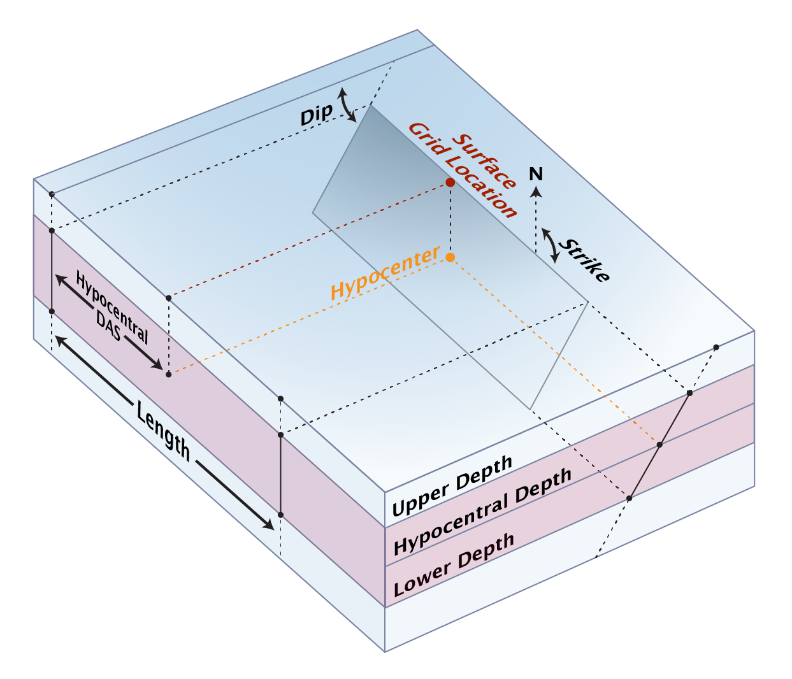

_**PREVIEW**: This is a preview of the new file format, pending formal release on [ScienceBase](https://www.sciencebase.gov/). Preview solutions for the 2023 National Seismic Hazard Model (NSHM23) are available upon request. UCERF3 files are still stored in the [Legacy Fault System Solution](Legacy-Fault-System-Solution) format, but branch averaged solutions in this format are available to download for testing: [FM 3.1](https://opensha.usc.edu/ftp/ucerf3_erf_modular/FM3_1_branch_averaged.zip), [FM 3.2](https://opensha.usc.edu/ftp/ucerf3_erf_modular/FM3_2_branch_averaged.zip), [FMs Combined](https://opensha.usc.edu/ftp/ucerf3_erf_modular/mean_ucerf3_sol.zip)._

The [UCERF3](https://wgcep.org/UCERF3) model introduced Fault System Rupture Sets and Solutions as data containers for earthquake rupture forecasts. A [Rupture Set](#fault-system-rupture-set) defines all of the on-fault supra-seismogenic ruptures in a fault system, and their properties (magnitude, rake, etc). A [Solution](#fault-system-solution) defines the annual rate of occurrence of each rupture, and may also supply information about gridded seismicity.

Data are stored in a zip file consisting primarily of [JSON](https://www.json.org/), [GeoJSON](https://geojson.org/), and [CSV](https://en.wikipedia.org/wiki/Comma-separated_values) files for ease of human and machine readability. Rupture sets and solutions are stored in the `ruptures` and `solution` subdirectories of the zip file, respectively.

Example files presented here are often shortened for brevity, indicated by `...`.

A small but complete Fault System Solution (that, by definition, also contains a Rupture Set) can be [downloaded here for testing](https://github.com/opensha/opensha/raw/master/src/test/resources/org/opensha/sha/earthquake/faultSysSolution/demo_sol.zip).

Files in this format can be loaded in [nightly builds of OpenSHA application](Developers#nightly-builds), or via code in OpenSHA via the `load(File)` method on `org.opensha.sha.earthquake.faultSysSolution.FaultSystemSolution` and `org.opensha.sha.earthquake.faultSysSolution.FaultSystemRupSet`. You can build your own fault system rupture sets and solutions with [OpenSHA Fault-System Tools](https://github.com/opensha/opensha-fault-sys-tools).

### Table of Contents

* [Fault System Rupture Set](#fault-system-rupture-set)
  * [Fault Section Data](#fault-section-data)
  * [Rupture Section Indices](#rupture-section-indices)
  * [Rupture Properties](#rupture-properties)
  * [Optional Additional Modules](#optional-rupture-set-modules)
* [Fault System Solution](#fault-system-solution)
  * [Rate Data](#rate-data)
  * [Gridded Seismicity Data](#gridded-seismicity-data)
  * [Optional Additional Modules](#optional-solution-modules)

## Fault System Rupture Set
_[(return to top)](#table-of-contents)_

Fault System Rupture Sets define a set of fault sections and supra-seismogenic ruptures (and their properties) on those sections. Their data are stored in the `ruptures` subdirectory of a zip file.

Here is a summary of files likely to be in a rupture set zip file:

| File Name | Required? | Format | Description |
| --- | --- | --- | --- |
| `ruptures/fault_sections.geojson` | **YES** | [GeoJSON](#fault-section-data) | Fault section geometries |
| `ruptures/indices.csv` | **YES** | [CSV](#rupture-section-indices) | Lists of section indices that comprise each rupture |
| `ruptures/properties.csv` | **YES** | [CSV](#rupture-properties) | Rupture properties (mag, rake, length, area) |
| `ruptures/average_slips.csv` | _(no)_ | [CSV](#optional-module-average-slips) | Average slip information for each rupture |
| `ruptures/tectonic_regimes.csv` | _(no)_ | [CSV](#optional-module-tectonic-regimes) | Tectonic regime information for each rupture |
| `ruptures/modules.json` | _(no)_ | JSON | Manifest of Rupture Set modules, used by OpenSHA |

### Fault Section Data
_[(return to top)](#table-of-contents)_

Rupture sets usually contain a large number of fault _subsections_, which are small equal-length subdivisions of each parent fault section (typically with length approximately equal to half the siesmogenic thickness of the fault). Those _subsections_ are stored in the [Fault Section GeoJSON format](Geospatial-File-Formats#fault-data) with the added requirement that each section be listed in order of their `id`s, starting with `id=0` and ending with `id=(numSections-1)`. The GeoJSON will be stored in `ruptures/fault_sections.geojson`.

Here is an example fault section data file with 9 subsections spanning two faults:

```json
{
  "type": "FeatureCollection",
  "features": [
    {
      "type": "Feature",
      "id": 0,
      "properties": {
        "FaultID": 0,
        "FaultName": "Demo S-S Fault, Subsection 0",
        "DipDeg": 90.0,
        "Rake": 180.0,
        "LowDepth": 12.0,
        "UpDepth": 0.0,
        "DipDir": 0.0,
        "AseismicSlipFactor": 0.0,
        "CouplingCoeff": 1.0,
        "SlipRate": 10.0,
        "ParentID": 11,
        "ParentName": "Demo S-S Fault",
        "SlipRateStdDev": 1.0
      },
      "geometry": {
        "type": "LineString",
        "coordinates": [
          [
            -118.0,
            34.7
          ],
          [
            -118.00000000000001,
            34.75
          ]
        ]
      }
    },
...
    {
      "type": "Feature",
      "id": 8,
      "properties": {
        "FaultID": 8,
        "FaultName": "Demo Reverse Fault, Subsection 2",
        "DipDeg": 45.0,
        "Rake": 90.0,
        "LowDepth": 12.0,
        "UpDepth": 0.0,
        "DipDir": 0.0,
        "AseismicSlipFactor": 0.0,
        "CouplingCoeff": 1.0,
        "SlipRate": 3.0,
        "ParentID": 25,
        "ParentName": "Demo Reverse Fault",
        "SlipRateStdDev": 0.5
      },
      "geometry": {
        "type": "LineString",
        "coordinates": [
          [
            -118.29993824145802,
            35.300020582168905
          ],
          [
            -118.35,
            35.35
          ]
        ]
      }
    }
  ]
}
```

### Rupture Section Indices
_[(return to top)](#table-of-contents)_

The `ruptures/indices.csv` file lists the participating subsections for each rupture. It is stored in a CSV file. The first row of the CSV file shall contain column headings, but the content of the header is not checked and need not exactly match the example given below (for example, the '# 1', '# 2', etc., columns are included here for readability but can be omitted). Ruptures should then be listed in order, and the first rupture shall be index 0.

The participating subsections are indicated by their (0-based) index, so for the example below, rupture 0 consists of subsections 0 and 1, and rupture 1 consists of subsections 0, 1, and 2. The total number of columns in the CSV file is equal to the number of sections in the largest rupture plus 2, and each line may have different column counts.

An example is given below with 28 ruptures on the 9 previously defined fault subsections:

|Rupture Index|Num Sections|# 1|# 2|# 3|# 4|# 5|# 6|# 7|# 8|# 9|
|-------------|------------|---|---|---|---|---|---|---|---|---|
|0            |2           |0  |1  |   |   |   |   |   |   |   |
|1            |3           |0  |1  |2  |   |   |   |   |   |   |
|2            |4           |0  |1  |2  |3  |   |   |   |   |   |
|3            |5           |0  |1  |2  |3  |4  |   |   |   |   |
|4            |6           |0  |1  |2  |3  |4  |5  |   |   |   |
|5            |8           |0  |1  |2  |3  |4  |5  |6  |7  |   |
|6            |9           |0  |1  |2  |3  |4  |5  |6  |7  |8  |
|7            |2           |1  |2  |   |   |   |   |   |   |   |
|8            |3           |1  |2  |3  |   |   |   |   |   |   |
|9            |4           |1  |2  |3  |4  |   |   |   |   |   |
|10           |5           |1  |2  |3  |4  |5  |   |   |   |   |
|...          |...         |...|...|...|...|...|...|...|...|...|
|27           |2           |7  |8  |   |   |   |   |   |   |   |

### Rupture Properties
_[(return to top)](#table-of-contents)_

Rupture properties are stored in `ruptures/properties.csv` that gives the magnitude, rake, area, and length of each rupture. It is stored in a CSV file. The first row of the CSV file shall contain column headings, but the content of the header is not checked and need not exactly match the example given below. Ruptures should then be listed in order, and the first rupture shall be index 0.

An example is given below with 28 ruptures on the 9 previously defined fault subsections:

|Rupture Index|Magnitude|Average Rake (degrees)|Area (m^2)|Length (m)|
|-------------|---------|----------------------|----------|----------|
|0            |6.105    |180.0                 |1.33434E8 |11119.5   |
|1            |6.329    |180.0                 |2.00151E8 |16679.3   |
|2            |6.496    |180.0                 |2.66868E8 |22239.0   |
|3            |6.625    |180.0                 |3.33585E8 |27798.8   |
|4            |6.73     |180.0                 |4.00302E8 |33358.5   |
|5            |6.972    |148.7                 |6.43906E8 |47713.0   |
|6            |7.062    |137.6                 |7.65707E8 |54890.2   |
|7            |6.105    |180.0                 |1.33434E8 |11119.5   |
|8            |6.329    |180.0                 |2.00151E8 |16679.3   |
|9            |6.496    |180.0                 |2.66868E8 |22239.0   |
|10           |6.625    |180.0                 |3.33585E8 |27798.8   |
|...          |...      |...                   |...       |...       |
|27           |6.367    |90.0                  |2.43603E8 |14354.5   |

### Optional Rupture Set Modules
_[(return to top)](#table-of-contents)_

Extra information or data beyond the requirements outlined above may be attached via optional OpenSHA modules. If present (as will be the case for files written by OpenSHA), the `ruptures/modules.json` file will list all included modules as well as their associated data files and Java class name within the [OpenSHA codebase](https://github.com/opensha/opensha). Some common modules are documented below.

#### Optional Module: Average Slips
_[(return to top)](#table-of-contents)_

The optional average slips module, if present, includes the average slip for each rupture across the entire rupture surface. When combined with rupture rates, this can be used to compute solution slip rates or moment rates. Average slip data are stored in `ruptures/properties.csv`, a two column CSV file (with a header row) that lists the rupture index and average slip data (in meters) for each rupture. Average slip data must always be listed in order and for every rupture (with 0-based indexing). An example is given below:

| Rupture Index | Average Slip (m)   |
|---------------|--------------------|
| 0             | 1.1647160534906944 |
| 1             | 1.426480989099377  |
| 2             | 1.4490078253186767 |
| 3             | 1.57199038614192   |
| 4             | 1.6860260586392295 |
| 5             | 1.792822904443835  |
| ...           | ...                |
| 27            | 0.8620093923941858 |

#### Optional Module: Tectonic Regimes
_[(return to top)](#table-of-contents)_

The optional tectonic regimes module, if present, lists the associated [tectonic regime](Glossary#tectonic-regime) for each rupture. This is most often used in hazard calculations to select the appropriate ground motion models for each rupture. Data are stored in `ruptures/tectonic_regimes.csv`, a two column CSV file (with a header row) that lists the rupture index and [OpenSHA tectonic regime enum constant](Glossary#tectonic-regime). Data must always be listed in order and for every rupture (with 0-based indexing). An example is given below:

| Rupture Index | Tectonic Regime |
|---------------|-----------------|
| 0             | ACTIVE_SHALLOW  |
| 1             | ACTIVE_SHALLOW  |
| 2             | ACTIVE_SHALLOW  |
| 3             | ACTIVE_SHALLOW  |
| 4             | ACTIVE_SHALLOW  |
| 5             | ACTIVE_SHALLOW  |
| ...           | ...             |
| 27            | ACTIVE_SHALLOW  |

## Fault System Solution
_[(return to top)](#table-of-contents)_

Fault System Solutions define the rate of each rupture from a Rupture Set (called a 'solution' because those rates are usually the result of an inversion). They may optionally also include gridded seismicity data. Their data are stored in the `solution` subdirectory of a zip file.

A solution must also contain a rupture set (in the `ruptures` top-level subdirectory). In addition to the standard rupture set files, here is a summary of files likely to be in a solution zip file:

| File Name | Required? | Format | Description |
| --- | --- | --- | --- |
| `solution/rates.csv` | **YES** | [CSV](#rate-data) | Annual rates for each rupture |
| `solution/grid_mech_weights.csv` | _(no)_ | [CSV](#gridded-seismicity-focal-mechanism-rates) | Focal mechanism weights for each gridded seismicity location |
| `solution/grid_region.geojson` | _(no)_ | [GeoJSON](#gridded-seismicity-region) | Gridded seismicity region |
| `solution/grid_source_locations.csv` | _(no)_ | [CSV](#gridded-seismicity-source-locations) | Locations and indexes of gridded seismicity sources |
| `solution/grid_sources.csv` | _(no)_ | [CSV](#gridded-seismicity-sources) | Gridded seismicity ruptures |
| `solution/modules.json` | _(no)_ | JSON | Manifest of Solution modules, used by OpenSHA |

### Rate Data
_[(return to top)](#table-of-contents)_

Solution annual rate data for each rupture is stored in a simple 2-column CSV file, `solution/rates.csv`. The first row of the CSV file shall contain column headings, but the content of the header is not checked and need not exactly match the example given below. Ruptures should then be listed in order, and the first rupture shall be index 0. An example is below:

|Rupture Index|Annual Rate|
|-------------|-----------|
|0            |0.005320239194616782|
|1            |0.005298660169966246|
|2            |7.834210706407277E-4|
|3            |1.8703779639406976E-7|
|4            |0.0026397968587955787|
|5            |1.4234970401212632E-8|
|6            |5.675850061305903E-4|
|7            |9.987701252958843E-9|
|8            |3.866169289703722E-7|
|9            |3.636288131991794E-7|
|10           |4.219820930141324E-7|
|...          |...                 |
|27           |3.7916393801626976E-7|

### Gridded Seismicity Data
_[(return to top)](#table-of-contents)_

Solutions may optionally provided gridded seismicity information. For a fault system solution, gridded seismicity can refer to either off-fault earthquakes (those 'unassociated' with any fault) or sub-seismogenic ruptures on a fault but smaller than the ruptures defined in the [rupture set](#fault-system-rupture-set). This data is stored in multiple files, each of which is summarized below.

#### Gridded Seismicity Region
_[(return to top)](#table-of-contents)_

The gridded region used to define the set of gridded seismicity locations is stored in `solution/grid_region.geojson`. It follows the OpenSHA [Gridded Region File Format](Geospatial-File-Formats#gridded-regions), and is omitted here for brevity, but the region used for the examples below has 81 grid nodes.

This optional file is for information purposes and easy plotting of the gridded seismicity region. Locations of gridded seismicity sources are found in the [Gridded Seismicity Source Locations](#gridded-seismicity-source-locations) file.

#### Gridded Seismicity Source Locations
_[(return to top)](#table-of-contents)_

The `solution/grid_source_locations.csv` CSV file lists the indexes and locations of each gridded seismicity source. The first row of the CSV file shall contain column headings, but the content of the header is not checked and need not exactly match the example given below. Grid nodes should then be listed in order, and the first node shall be index 0.

| rid Index | Latitude | Longitude |
|-----------|----------|-----------|
| 0         | 34       | -120      |
| 1         | 34       | -119.75   |
| 2         | 34       | -119.5    |
| 3         | 34       | -119.25   |
| 4         | 34       | -119      |
| 5         | 34       | -118.75   |
| 6         | 34       | -118.5    |
| 7         | 34       | -118.25   |
| 8         | 34       | -118      |
| 9         | 34.25    | -120      |
| 10        | 34.25    | -119.75   |
| ...       | ...      | ...       |
| 80        | 36       | -118      |

#### Gridded Seismicity Sources
_[(return to top)](#table-of-contents)_

The `solution/grid_sources.csv` CSV file lists properties and rates of each gridded seismicity source. The first row of the CSV file shall contain column headings, but the content of the header is not checked and need not exactly match the example given below. The columns are:

| _Column Name_              | _Description_ |
|----------------------------|---------------|
| Grid Index                 | Grid node index from the `grid_source_locations.csv` file |
| Magnitude                  | Gridded rupture magnitude |
| Annual Rate                | Gridded rupture annual rate of occurrence |
| Rake                       | Gridded rupture rake angle (degrees) |
| Dip                        | Gridded rupture dip angle (degrees) |
| Strike                     | Gridded rupture strike angle (degrees), or blank for unknown |
| Upper Depth (km)           | Upper depth of the rupture (kilometers) |
| Lower Depth (km)           | Lower depth of the rupture (kilometers) |
| Length (km)                | Length of the rupture (kilometers) |
| Hypocentral Depth (km)     | Hypocentral depth of the rupture (kilometers). This will typically only be used if the strike angle is also supplied (or if random-strike ruptures are built in hazard calculations). If omitted (blank), the hypocentral depth is assumed to be halfway between the upper and lower depth. See schematic below. |
| Hypocentral DAS (km)       | Hypocentral distance along strike (DAS) of the rupture (kilometers). This will typically only be used if the strike angle is also supplied (or if random-strike ruptures are built in hazard calculations). If omitted (blank), the hypocentral DAS is assumed to be halfway along the rupture (half of the length). See schematic below. |
| Tectonic Regime            | Tectonic regime for this rupture; one of the OpenSHA enum constants [listed here](Glossary#tectonic-regime) |
| Associated Section Index 1 | Optional: section index from the rupture set for which this gridded rupture is associated. The fraction of that association is given in the following column, and additional sections will be listed as additional column pairs. |
| Fraction Associated 1      | Optional: fractional association of the fault section index supplied in the previous column |

Below is a schematic diagram showing each column visually for the case where a rupture strike has been assigned. If the strike is not assigned, various point-source approximations exist to approximate finite fault effects and average source-to-site distances. If a true point source is desired, set the length to 0, the upper and lower depths to the same value, and leave the strike field blank.



Here is an example, showing both associated and unassociated ruptures:

| Grid Index | Magnitude | Annual Rate | Rake | Dip | Strike | Upper Depth (km) | Lower Depth (km) | Length (km) | Hypocentral Depth (km) | Hypocentral DAS (km) | Tectonic Regime | Associated Section Index 1 | Fraction Associated 1 | Associated Section Index N | Fraction Associated N |   |          |   |          |
|------------|-----------|-------------|------|-----|--------|------------------|------------------|-------------|------------------------|----------------------|-----------------|----------------------------|-----------------------|----------------------------|-----------------------|---|----------|---|----------|
| 0          | 5.05      | 0.00514342  | 0    | 90  |        | 5                | 6.23             | 1.84        |                        |                      | ACTIVE_SHALLOW  |                            |                       |                            |                       |   |          |   |          |
| 0          | 5.05      | 0.00257171  | 90   | 50  |        | 5                | 5.94             | 1.84        |                        |                      | ACTIVE_SHALLOW  |                            |                       |                            |                       |   |          |   |          |
| 0          | 5.05      | 0.00257171  | −90  | 50  |        | 5                | 5.94             | 1.84        |                        |                      | ACTIVE_SHALLOW  |                            |                       |                            |                       |   |          |   |          |
| 0          | 5.15      | 0.00408556  | 0    | 90  |        | 5                | 6.44             | 2.16        |                        |                      | ACTIVE_SHALLOW  |                            |                       |                            |                       |   |          |   |          |
| 0          | 5.15      | 0.00204278  | 90   | 50  |        | 5                | 6.1              | 2.16        |                        |                      | ACTIVE_SHALLOW  |                            |                       |                            |                       |   |          |   |          |
| 0          | 5.15      | 0.00204278  | −90  | 50  |        | 5                | 6.1              | 2.16        |                        |                      | ACTIVE_SHALLOW  |                            |                       |                            |                       |   |          |   |          |
| 0          | 5.25      | 0.00324528  | 0    | 90  |        | 5                | 6.68             | 2.53        |                        |                      | ACTIVE_SHALLOW  |                            |                       |                            |                       |   |          |   |          |
| 0          | 5.25      | 0.00162264  | 90   | 50  |        | 5                | 6.29             | 2.53        |                        |                      | ACTIVE_SHALLOW  |                            |                       |                            |                       |   |          |   |          |
| 0          | 5.25      | 0.00162264  | −90  | 50  |        | 5                | 6.29             | 2.53        |                        |                      | ACTIVE_SHALLOW  |                            |                       |                            |                       |   |          |   |          |
| ...        | ...       | ...         | ...  | ... | ...    | ...              | ...              | ...         | ...                    | ...                  | ...             |                            |                       |                            |                       |   |          |   |          |
| 35         | 5.05      | 0.0240135   | 0    | 90  |        | 5                | 6.23             | 1.84        |                        |                      | ACTIVE_SHALLOW  | 3                          | 0.224517              | 4                          | 0.224517              | 5 | 0.224517 | 6 | 0.112259 |
| 35         | 5.05      | 0.0120067   | 90   | 50  |        | 5                | 5.94             | 1.84        |                        |                      | ACTIVE_SHALLOW  | 3                          | 0.224517              | 4                          | 0.224517              | 5 | 0.224517 | 6 | 0.112259 |
| 35         | 5.05      | 0.0120067   | −90  | 50  |        | 5                | 5.94             | 1.84        |                        |                      | ACTIVE_SHALLOW  | 3                          | 0.224517              | 4                          | 0.224517              | 5 | 0.224517 | 6 | 0.112259 |
| 35         | 5.15      | 0.0190746   | 0    | 90  |        | 5                | 6.44             | 2.16        |                        |                      | ACTIVE_SHALLOW  | 3                          | 0.224517              | 4                          | 0.224517              | 5 | 0.224517 | 6 | 0.112259 |
| 35         | 5.15      | 0.00953728  | 90   | 50  |        | 5                | 6.1              | 2.16        |                        |                      | ACTIVE_SHALLOW  | 3                          | 0.224517              | 4                          | 0.224517              | 5 | 0.224517 | 6 | 0.112259 |
| 35         | 5.15      | 0.00953728  | −90  | 50  |        | 5                | 6.1              | 2.16        |                        |                      | ACTIVE_SHALLOW  | 3                          | 0.224517              | 4                          | 0.224517              | 5 | 0.224517 | 6 | 0.112259 |
| ...        | ...       | ...         | ...  | ... | ...    | ...              | ...              | ...         | ...                    | ...                  | ...             |                            |                       |                            |                       |   |          |   |          |

#### Legacy (MFD-Based) Gridded Seismicity Data files
_[(return to top)](#table-of-contents)_

An earlier version of this file format gave gridded seismicity data by specifying magnitude-frequency distributions at each grid node. Although conceptually simple, that format didn't supply enough information about how to implement the gridded seismicity sources in hazard calculations and has been deprecated. Its format is archived below for posterity.

##### Legacy Gridded Seismicity Focal Mechanism Rates
_[(return to top)](#table-of-contents)_

Each gridded seismicity node can have ruptures of various focal mechanisms: strike-slip, normal, and reverse. This file gives the fraction of seismicity associated with each node that corresponds to each of those focal mechanisms. This data is stored in `solution/grid_mech_weights.csv` and the format is given below. The first row of the CSV file shall contain column headings, but the content of the header is not checked and need not exactly match the example given below. Grid nodes should then be listed in order, and the first node shall be index 0.

|Node Index|Latitude          |Longitude|Fraction Strike-Slip|Fraction Reverse|Fraction Normal|
|----------|------------------|---------|--------------------|----------------|---------------|
|0         |34.0              |-120.0   |0.5                 |0.25            |0.25           |
|1         |34.0              |-119.75  |0.5                 |0.25            |0.25           |
|2         |34.0              |-119.5   |0.5                 |0.25            |0.25           |
|3         |34.0              |-119.25  |0.5                 |0.25            |0.25           |
|4         |34.0              |-119.0   |0.5                 |0.25            |0.25           |
|5         |34.0              |-118.75  |0.5                 |0.25            |0.25           |
|6         |34.0              |-118.5   |0.5                 |0.25            |0.25           |
|7         |34.0              |-118.25  |0.5                 |0.25            |0.25           |
|8         |34.0              |-118.0   |0.5                 |0.25            |0.25           |
|9         |34.25             |-120.0   |0.5                 |0.25            |0.25           |
|10        |34.25             |-119.75  |0.5                 |0.25            |0.25           |
|...|...|...|...|...|...|
|80        |36.0              |-118.0   |0.5                 |0.25            |0.25           |

##### Legacy Gridded Seismicity MFDs
_[(return to top)](#table-of-contents)_

Magnitude-Frequency distributions (MFDs) for each grid node are stored in a CSV file format. Each grid node can have 2 MFDs, one for sub-seismogenic ruptures associated with a fault (`solution/grid_sub_seis_mfds.csv`), and another for ruptures unassociated with any fault (`solution/grid_unassociated_mfds.csv`), but many grid nodes will only have 1 of those types.

The format for each file is identical, and the first row of each CSV file shall contain column headings which are used to define the X-values of the MFD (this may vary from model to model). Grid nodes need not be listed in order and can be skipped if no MFD exists for a particular node (or, alternatively, rows can be left blank after the 3-column row header to indicate that no MFD exists for a node).

Here is an example file that contains MFDs for some nodes and omits them for others:

|Node Index|Latitude|Longitude|5.05      |5.15      |5.25      |5.35      |...       |8.4       |
|----------|--------|---------|----------|----------|----------|----------|----------|----------|
|8         |34      |-118     |0.0381873 |0.0303332 |0.0240946 |0.019139  |...       |0.0       |
|17        |34.25   |-118     |0.0311113 |0.0247126 |0.0196299 |0.0155926 |...       |0.0       |
|26        |34.5    |-118     |0.0381873 |0.0303332 |0.0240946 |0.019139  |...       |0.0       |
|35        |34.75   |-118     |0.0381873 |0.0303332 |0.0240946 |0.019139  |...       |0.0       |
|44        |35      |-118     |0.0381873 |0.0303332 |0.0240946 |0.019139  |...       |0.0       |
|52        |35.25   |-118.25  |0.00806943|0.00640978|0.00509147|0.0040443 |...       |0.0       |
|53        |35.25   |-118     |0.0381873 |0.0303332 |0.0240946 |0.019139  |...       |0.0       |
|59        |35.5    |-118.75  |0.00806943|0.00640978|0.00509147|0.0040443 |...       |0.0       |
|60        |35.5    |-118.5   |0.00807135|0.0064113 |0.00509268|0.00404526|...       |0.0       |
|62        |35.5    |-118     |0.0381873 |0.0303332 |0.0240946 |0.019139  |...       |0.0       |
|67        |35.75   |-119     |0.00806943|0.00640978|0.00509147|0.0040443 |...       |0.0       |
|68        |35.75   |-118.75  |0.00807135|0.0064113 |0.00509268|0.00404526|...       |0.0       |
|71        |35.75   |-118     |0.0381873 |0.0303332 |0.0240946 |0.019139  |...       |0.0       |
|75        |36      |-119.25  |0.00806943|0.00640978|0.00509147|0.0040443 |...       |0.0       |
|76        |36      |-119     |0.00807135|0.0064113 |0.00509268|0.00404526|...       |0.0       |
|80        |36      |-118     |0.0381873 |0.0303332 |0.0240946 |0.019139  |...       |0.0       |

### Optional Solution Modules
_[(return to top)](#table-of-contents)_

Extra information or data beyond the requirements outlined above may be attached via optional OpenSHA modules. If present (as will be the case for files written by OpenSHA), the `solution/modules.json` file will list all included modules as well as their associated data files and Java class name within the [OpenSHA codebase](https://github.com/opensha/opensha). Some common modules are documented below.

