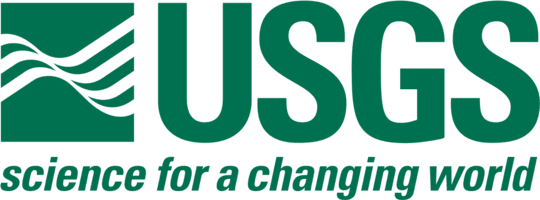

OpenSHA has evolved over many years and would not have been possible without the dedicated financial support of the [Statewide California Earthuake Center (SCEC)](https://www.scec.org/) at the [University of Southern California (USC)](http://www.usc.edu/) and the [United States Geological Survey (USGS)](http://earthquake.usgs.gov/) earthquake hazards program. In addition, the use of OpenSHA in developing the [Uniform California Earthquake Rupture Forecasts (UCERF2/3)](http://www.wgcep.org/) has provided additional income from the [California Earthquake Authority (CEA)](http://www.earthquakeauthority.com/). The [Global Earthquake Model (GEM)](http://www.globalquakemodel.org/) Foundation provided some prior financial support to adapt OpenSHA to function as their engine for global hazard calculations.

## Statewide California Earthquake Center (SCEC)

[SCEC](https://www.scec.org) is a community of over 600 scientists, students, and others at over 60 institutions worldwide, headquartered at the University of Southern California. SCEC is funded by the National Science Foundation and the U.S. Geological Survey to develop a comprehensive understanding of earthquakes in Southern California and elsewhere, and to communicate useful knowledge for reducing earthquake risk.

## United States Geological Survey (USGS)

From their [home page](https://www.usgs.gov/): "We provide science about the natural hazards that threaten lives and livelihoods; the water, energy, minerals, and other natural resources we rely on; the health of our ecosystems and environment; and the impacts of climate and land-use change. Our scientists develop new methods and tools to supply timely, relevant, and useful information about the Earth and its processes."

## California Earthquake Authority (CEA)

The [CEA](http://www.earthquakeauthority.com/) is a publicly managed, largely privately funded organization that provides catastrophic residential earthquake insurance and encourages Californians to reduce their risk of earthquake loss.
