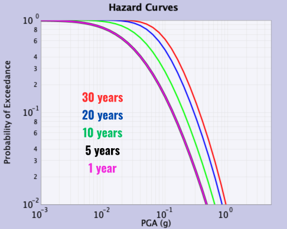

## Hazard Curve Calculator

This tutorial demonstrates how to replicate the hazard curve figures presented.

Start by downloading and launching the [Hazard Curve Calculator application](Applications) and follow the instructions below to reproduce various figures.

### UCERF3 Epistemic List ERF

<ol>
<li>Choose the IMR (or attenuation relationship) by choosing Campbell and Bozorgnia (2014) from the first list in the "Set IMR" window.</li>
<li>Set the IMT (intensity-measure type) by choosing "PGA" from the first list in the "Set IMT" window.</li>
<li>Set the latitude and longitude in the "Set Site Params" window to be 37.8 and -122.417, respectively. This is a site near downtown San Francisco that happens to be a class "B" site according to the site-conditions map of Wills et al. (2000). An alternative way to set this latitude and longitude is to select "Sites of Interest" from the "Control Panels" list at the bottom of the application, and then choose "San Francisco Class B" from the window that pops up.</li>
<li>Choose an ERF (Earthquake Rupture Forecast) by doing the following: click the "ERF & Time Span" tab at the top of the application, and under the "Eqk Rup Forecast" list at the top of the sub-window, choose "UCERF3 Epistemic List ERF" (you might need to scroll down to see this option).</li>
<li>In the "Epistemic List Control" that automatically pops up, click the box next to "Plot Average" (the box next to "Plot all curves" should already be selected). Also choose "Plot Fractiles" from the list below, and click "Update Fractile List" at the bottom of the popup window. The window will automatically close when done.</li>
<li>In the main application, set the various ERF's parameters (listed below the chosen ERF) as follows:
  <ul>
  <li>Backgound Seismicity = "Exclude"</li>
  <li>Probability Model = "Poisson"</li>
  <li>Deformation Model = "Geologic"</li>
  <li>Scaling Relationship = "(all)"</li>
  <li>Slip Along Rupture (Dsr) = "Uniform"</li>
  <li>Inversion Model = "Characteristic (Constrained)"</li>
  <li>Total Mag 5 Rate = "RATE_6p5"</li>
  <li>MMax Off Fault = "MAG_7p3"</li>
  <li>Moment Rate Fixes = "NONE"</li>
  <li>Spatial Seismicity PDF = "UCERF3"</li>
  </ul>
All other parameters should be left at their default.
</li>

<li>Initiate the computation by clicking "Compute" at the bottom of the application.</li>
<li>Convert to a log-log plot by clicking both the "X" and "Y" check-boxes next to "Log scale" at the bottom of the application.</li>
<li>Change the color scheme by clicking "Plot Prefs" at the bottom of the application and in the popup window set the following for each Dataset:
  <ul>
  <li>DATASET #1 Curves: Color as Green and Size as 2</li>
  <li>DATASET #1 Fractiles: Color as Blue and Size as 2</li>
  <li>DATASET #1 Mean: Color as Red and Size as 2</li>
  </ul>
Note that there is an active bug (<a href="https://github.com/opensha/opensha/issues/159">#159</a>) that may result in unlabelled datasets for fractiles and curves. If this occurs for you, try swapping color assignments to replicate the plot below.

</li>

<li>Click "Done". Change the axis limits by clicking "Set Axis" at the bottom of the application; then choose "Custom Scale" from the top of the popup window and set "Min X" = 1.0E-2, "Max X" = 1.0, and "Min Y" = 0.1. Click "OK" to apply the changes and close the window.</li>
</ol>
The window you now see represents the screenshot shown in Figure 1.

|  | 
|:--:| 
| *Figure 1: Plots with all scaling relationships for the UCERF3 Epistemic List ERF* |

### National Seismic Hazard Model 2023 - Western US Branch Averaged ERF
(assumes completion of steps 1-10 above)

<ol start="11">
<li>Put the present plot aside by clicking "Peel Off" at the bottom of the application (or click "Clear Plot")</li>
<li>In the main application, make it so we'll only plot the mean curves by doing the following: in the "Control Panels" list at the bottom of the application, choose "Epistemic List Control" (you might need to scroll down to see it). Deselect "Plot all curves", and choose "No Fractiles". Only the "Plot Average" option should remain selected</li>
<li>Return to the "IMR, IMT & Site" tab. Set IMT to "PGA" in the "Set IMT" window and set the IMR to "USGS NSHM23 Active Crustal" under "Set IMR"</li>
<li>Go to the "ERF & Time Span" tab and set the ERF to "NSHM23-WUS (crustal only, excl. Cascadia) Branch Avg ERF"</li>
<li>Compute the average by again clicking "Compute" at the bottom of the application</li>
<li>Now redo this calculation using a different IMR (attenuation relationship) by doing the following: click the "IMR, IMT & Site" tab at the top of the application (if you haven't already done this), under the "Set IMR" window choose "Abrahamson, Silve & Kamai (2014)" from the list at the top, set the IMT to "PGA" in the "Set IMT" window below, and click "Compute" at the bottom</li>
<li>Repeat step (16) for the "Boore, Stewart, Sheehan & Atkinson (2014)", "Campbell & Bozorgnia (2014)" and "Chiou & Youngs (2014)" attenuation relationships in that order (and be sure to set the IMT to PGA each time)</li>
<li>Increase the size of the lines to 2.0 (by clicking "Plot Prefs"). Change the axis range (by clicking "Set Axis") such that "Min X" = 0.01, "Max X" = 0.2, and "Min Y" = 0.5. You have now reproduced Figure 2. Note that you can save a png version of the image by selecting the "Save" option in the "File" menu at the upper left corner of the application or by clicking on the save icon symbol at the top left of the application</li>
</ol>

|  | 
|:--:| 
| *Figure 2: NSHM23-WUS ERF plotted with different IMRs* |

### Varied Time Spans
(assumes completion of steps 1-18 above)

<ol start="19">
<li>Click either "Peel Off" or "Clear Plot" at the bottom of the application</li>
<li>In the main application, re-select the "USGS NSHM23 Active Crustal" IMR (attenuation relationship), set the IMT to PGA, and click "Compute" at the bottom of the application. This re-plots the mean curve shown in Figure 2</li>
<li>Click the "ERF & Time Span" tab at the top of the application, and on the right side change the time-span "Duration" from 30 to 20 years. Click "Compute" at the bottom of the application</li>
<li>Repeat step (22) for durations of 10, 5, and 1 (in that order)</li>
<li>Set the axis range such that "Min X" = 1.0E-3, "Max X" = 5.0, and "Min Y" = 0.01. Click "OK" to apply the changes and close the window</li>
<li>After increasing the size of the lines to 2.0, except the black line to set to 4.0 (by clicking "Plot Prefs"), and changing the axis range (by clicking "Set Axis") like in step (10), you have now reproduced Figure 3</li>
</ol>

|  | 
|:--:| 
| *Figure 3: NSHM23-WUS ERF plotted over different time spans* |


## Attenuation Relationship Plotter

This short guide explains the basic steps required to plot and compare the Attenuation Relationships implemented in OpenSHA.

### Creating a Plot

<ol>
<li>Select an Attenuation Relationship from the "Choose Model" combo box (located directly above the plot window).</li>
<li>Choose an IMT from the combo box at the upper right (the options will depend on what's supported by your chosen Attenuation Relationship)</li>
<li>Below that, choose from among the following to plot on the Y-axis:
  <ul>
  <li>Median</li>
  <li>Standard Deviation</li>
  <li>Exceedance Prob (for specified IML)</li>
  <li>IML at Exceedance Prob</li>
  </ul>
</li>
<li>Next, choose what you want to plot on the X-axis. The options are generally any parameter applicable to your chosen attenuation relationship that represents a numerical value (the options also depend on what you've chosen for the Y-axis).</li>
<li>Finally, set all the other parameters that your chosen attenuation relationship depends upon (the list, which is on the lower right, depends on what you've chosen for the Y-axis). HINT: mousing over the parameter name should give you more info about that Parameter, and mousing over where you enter numerical values will show any limits on the allowed values for the parameter</li>
<li>Click the "Add Curve" button to calculate and show the plot.</li>
</ol>

You can add multiple curves, but the plot will automatically clear if you change what's plotted on either axis (e.g., you can't have both magnitude and distance on the X-axis; however, you can plot different Distance Parameters simultaneously on the X-axis).

### Other Options

* The "Clear Plot" button clears the plot.
* The "Peel-Off" button sets the current plot aside in a new window (e.g., to save it while you generate new plots).
* The "Add Data Points" button allows you to add your own data (e.g., values observed from an actual earthquake).
* The functionality of the other buttons at the bottom of the plot window should be self explanatory.

### Known Issues

* You cannot currently set how the X-axis is discretized, which may be frustrating if you want to know the Y-axis value for an exact X-axis value. You can use the "Individual Value" option under the X-axis combo box to show the Y-axis value for a specific set of parameter values.
* If, when you click the "Add Curve" button, you get a message asking whether you want to violate a "Warning Constraint" of a parameter (e.g., if you choose a Magnitude outside the range sanctioned by the chosen attenuation relationship), you may need to click the "Add Curve" button again to generate the plot (if you've accepted the value).

## Scenario ShakeMap

This tutorial demonstrates how to replicate Figure 1 as presented in:

```
Field, E. H, H. A. Seligson, N. Gupta, V. Gupta, T. H. Jordan, and K. Campbell (2005), Loss Estimates for a Puente Hills Blind-Thrust Earthquake in Los Angeles, California, Earthquake Spectra, 21, p. 329-338, DOI: 10.1193/1.1898332.
```

And also explains some additional features of the application. Start by downloading and launching the [Scenario ShakeMap application](Applications) and follow the instructions below to reproduce various figures.

The referenced figure is shown below. This figure from "Loss Estimates for a Puente Hills" should not be confused with "Figure 1" from the Hazard Curve Application tutorial.

|  | 
|:--:| 
| *The first figure from Field et al 2005: Loss Estimates for a Puente Hills Blind-Thrust Earthquake in Los Angeles, California* |

### Figure 1A
<ol>
<li>Under the "Intensity-Measure Relationship" tab, choose "PGA" from the "IMT" menu, and then choose "Abrahamson & Silva (1997)" from the "IMR" menu.</li>
<li>Under the "Region and Site Params" tab, set the following as:
  <ul>
  <li>"Min Longitude" = -119</li>
  <li>"Max Longitude" = -117</li>
  <li>"Min Latitude" = 33.5</li>
  <li>"Max Latitude" = 34.5</li>
  <li>"Grid Spacing" = 0.016667</li>
  <li>"Set Site Params" = "Use site data providers"</li>
  <li>"Default AS Site Type" = "Deep-Soil"</li>
  </ul>
</li>
<li>Under the "Earthquake Rupture" tab set the following:
  <ul>
  <li>"Select Method of Getting Eqk Rupture" = "Custom Eqk Rupture"</li>
  <li>"Rupture Type" = "Finite source rupture"</li>
  <li>"Magnitude" = 7.2</li>
  <li>"Rake (degrees)" = 90</li>
  </ul>
</li>
<li>Now click "Set Fault Surface" & set the following:
  <ul>
  <li>"Grid Spacing (km)" = 1.0</li>
  <li>"Num. of Fault Trace Points" = 4</li>
  </ul>
</li>
<li>Click "Fault Latitudes" and enter the following:
  <ul>
  <li>Lat-1 (Degrees) = 33.9451</li>
  <li>Lat-2 (Degrees) = 33.9423</li>
  <li>Lat-3 (Degrees) = 33.9746</li>
  <li>Lat-4 (Degrees) = 34.0768</li>
  </ul>
and click "Update Latitudes" when done.
</li>
<li>Likewise for "Fault Longitudes":
  <ul>
  <li>Lon-1 (Degrees) = -117.8679</li>
  <li>Lon-2 (Degrees) = -118.0315</li>
  <li>Lon-3 (Degrees) = -118.1253</li>
  <li>Lon-4 (Degrees) = -118.3194</li>
  </ul>
</li>
<li>"Num. of Dips" = 1</li>
<li>Click "Dips" and set it as 27 degrees</li>
<li>Click "Depths" and set:
  <ul>
  <li>"Depth-1 (km)" = 5.0</li>
  <li>"Depth-2 (km)" = 17.0</li>
  </ul>
</li>
<li>"Finite Fault Type" = "Stirling"</li>
<li>"Ave Dip Direction (degrees) " = leave this blank (so direction is perpendicular to ave strike)</li>
<li>Now click "Make Simple Fault" at the bottom</li>
<li>Finally, leave "Set Hypocenter Location" un-selected</li>
<li>Click the "Exceedance Level/Probability" tab and set:
  <ul>
  <li>"Map Type" = IML@Prob</li>
  <li>"Probability" = 0.5</li>
  </ul>
  These settings will give us a map of the median intensity-measure level (IML).
</li>
<li>Click the "Map Attributes" tab and set the following:
  <ul>
  <li>"Color Scheme" = "MaxSpectrum.cpt"</li>
  <li>"Color Scale Limits" = "Manually"</li>
  <li>"Color-Scale Min" = 0.0</li>
  <li>"Color-Scale Max" = 1.0</li>
  <li>"Topo Resolution (arc-sec)" = "18 sec US"</li>
  <li>"Highways in plot" = "None"</li>
  <li>"Coast" = "Draw & Fill"</li>
  <li>"Image Width (inches)" = 6.5</li>
  <li>"Plot Log" should NOT be selected</li>
  <li>"Generate Hazus Shape Files" should not be selected</li>
  <li>"Rupture-Surface Plotting" = "Draw Perimeter"</li>
  </ul>
</li>
<li>Now click "Make Map" at the bottom of the application and you should see Figure 1A in a few seconds.</li>
</ol>

### Figure 1B
(assumes completion of all prior steps)

<ol start="17">
<li>Click the "Earthquake Rupture" tab, change the Magnitude to 7.5.</li>
<li>Click "Make Map" at the bottom, and in a few seconds you should see Figure 1B.</li>
</ol>

### Figure 1C
(assumes completion of all prior steps)

<ol start="19">
<li>Change the Magnitude back to 7.2.</li>
<li> Click the "Intensity-Measure Relationship" tab and change the IMR parameter to "Boore, Joyner,& Fumal (1997)".</li>
<li> Clicking "Make Map" at the bottom you should see Figure 1C.</li>
</ol>

### Figure 1D
(assumes completion of all prior steps)

<ol start="22">
<li> Click the "Earthquake Rupture" tab, change the Magnitude to 7.5.</li>
<li> Click "Make Map" at the bottom, and you should see Figure 1D.</li>
</ol>

### Figure 1E
(assumes completion of all prior steps)

<ol start="24">
<li> Click the "Intensity-Measure Relationship" tab and change the IMT parameter to "SA" and the "SA Period" parameter to 1.0. Also change the IMR parameter to "Abrahamson & Silva (1997)".</li>
<li> Now click the "Map Attributes" tab and change the "Color-Scale Max" parameter to 2.11.</li>
<li> Click "Make Map" and you should see Figure 1E.</li>
</ol>
NOTE - the PGV calculations in the paper assume that PGV is proportional to 1-sec SA according to the Newmark Hall (1982) relationship:

1-sec SA = 1.056 PGV (SI units)

Therefore, the SA plot just made is identical to the PGV plot in the paper.

### Figure 1F
(assumes completion of all prior steps)

<ol start="27">
<li> Click the "Intensity-Measure Relationship" tab and change the IMR parameter to "Field (2000)".</li>
<li> Click "Make Map" to produces the final image in the plot (Figure 1F).</li>
</ol>

### Why do the Images Look Different?
* The slight color differences are due to resolution & image-format differences between the figure for the paper and the images generated here.
* The labeling and scale-format differences are due to post processing (touching up) done with Adobe Illustrator to make the figure for publication.
* By the way, a PostScript version of the plots you made, as well as the GMT scripts and data files, are available for download; just scroll to the bottom of the window below each plot to see the download link. This allows you to edit the PostScript files.

### What's the Difference Between the "Stirling" and "Frankel" Finite Fault Types?
The best way to see this is to compare the difference.

* First, click on the "Map Attributes" tab and change the "Rupture-Surface Plotting" parameter to "Draw Discrete Points".
* Now click the "Earthquake Rupture" tab, click "Set Fault Surface", set the "Grid Spacing" parameter to 2.0, and click the "Make Simple Fault" button at the bottom.
* Clicking the "Make Map" should show you the map made previously but with a discretized version of the fault surface (rather than the outline of the fault being drawn).
* This is the "Stirling" fault representation (where depth contours are parallel to the trace of the top of the fault).
* Now click "Set Fault Surface" again, change the "Finite Fault Type" parameter to "Frankel's", and then click the "Make Simple Fault" button at the bottom.
* Clicking the "Make Map" shows that Frankel's representation projects a rectangle down perpendicular to the local strike along the fault.
See also the glossary entries on Stirling and Frankel Fault Surfaces.

### What is the Other Way of Selecting an Earthquake Rupture?
Besides creating a custom earthquake rupture (what we did above), you can also choose one from any available Earthquake Rupture Forecast (ERF). For example, one can compute a Scenario ShakeMap for one of the Puente Hills ruptures defined in the ERF used to make our National Hazard Maps.

* Click the "Earthquake Rupture" tab, and under "Select method of getting Eqk Rupture" choose "Select EqkRupture from an ERF".
* Under "Eqk Rup Forecast" choose "USGS/CGS 2002 Adj. Cal. ERF", and in the window that pops up click "Update Forecast" at the bottom.
* Under "Source Index" choose source # 136 - their Puente Hills Characteristic source.
* Each source can have multiple ruptures (i.e., difference magnitudes and/or rupture locations on the fault), so you need to give a Rupture Index as well (info on each is given below). Choose one and click "Make Map".
* You might want to go back and select "Draw Perimeter" from the "Rupture-Surface Plotting" under the "Map Attributes" tab, otherwise you won't be able to see the shaking levels directly over the fault.

### Generate HAZUS Shape Files
* Choose "Generate Hazus Shape Files for Scenario" from the "Control Panels" menu, read the text, and click the button.